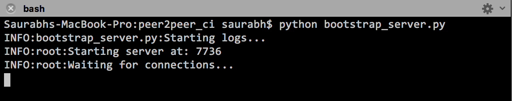
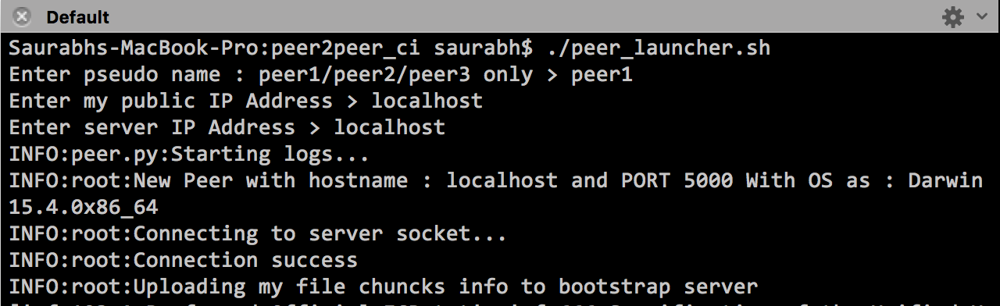

# Peer to Peer System

### Boot Strap Server

###### Run the bootstrap server before running any peers

```
python bootstrap_server.py
```

### Peers

###### Run the peers as shown below

```
bash$ ./peer_launcher.sh
```

Currently, the system is configured for three peers with peer names : peer1/peer2/peer3
Please follow the command line inputs while running this script.

Note: ** To run a peer with a different pseudo name first create a folder with the same pseudo name inside the 'data' folder. **


### Sample execution snapshot

#### server execution



#### peer execution




Note:

- As shown in the above image when the peer starts,
- First, it asks for pseudo name     --> Enter peer1/ peer2 /peer3
- Next it asks for my IP Address     --> {Public IP Address of the machine on which peer is running or localhost if server/peer run on the same machine}
- Next it asks for server IP Address --> {Public IP Address of the machine on which peer is running or localhost if server/peer run on the same machine}